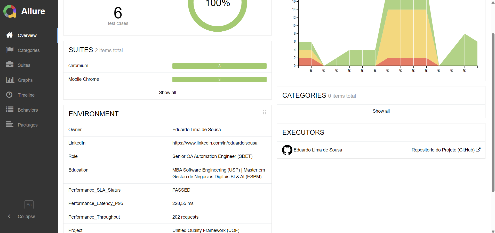

# Unified Quality Framework (UQF) 🚀

> **"Transformando a execução de testes automatizados em inteligência acionável para decisões de negócio."**

O **UQF** não é apenas uma suíte de testes; é um ecossistema de engenharia de confiabilidade desenhado para garantir escalabilidade, observabilidade e validação orientada a dados em aplicações web críticas.

---

## 🎯 Impacto Estratégico: O que resolvemos?

Em ambientes de alta volatilidade, automações comuns geram ruído. O **UQF** gera **valor**:

* **Mitigação de Risco em Tempo Real:** Identifica regressões funcionais e gargalos de performance antes que impactem o usuário final (*Shift-left*).
* **Observabilidade de Qualidade (QO):** Transforma logs brutos em métricas de SLA (P95, Throughput) para decisões baseadas em dados.
* **Aceleração do Time-to-Market:** Um pipeline unificado que reduz o ciclo de feedback entre desenvolvimento e QA.

---

## 🏗️ O Pipeline de Inteligência (Fluxo de Valor)

Para garantir a máxima confiabilidade, o UQF opera como um sistema integrado de fluxo de dados:

**Execução de Testes** (Playwright) → **Coleta de Telemetria** (K6) → **Processamento de Métricas** → **Centralização de Insights** (Allure)

1.  **Validação de Comportamento:** Garante a integridade dos fluxos críticos de negócio.
2.  **Monitoramento sob Carga:** Mede a latência exata (P95) durante a execução funcional.
3.  **Engenharia de Dados:** Correlaciona falhas de API com instabilidades de infraestrutura.
4.  **Entrega de Insights:** Reporte executivo que separa "bugs de código" de "falhas de ambiente".

---

## 📊 Evidências de Engenharia (O que isso permite decidir?)



*O Dashboard acima não é apenas um relatório de 'Pass/Fail', é uma ferramenta de decisão:*
* **Confiabilidade do Sistema:** 100% de sucesso nos fluxos críticos (Web/Mobile).
* **SLA de Performance:** Latência P95 controlada em 228,55 ms — sistema pronto para escala.
* **Diagnóstico Preciso:** Categorização inteligente que reduz o tempo médio de reparo (MTTR).

---

## 💎 Diferenciais Narrativos

* **QA Orientado a Dados (Data-Driven):** Auditoria de contratos de API que blinda a integração entre frontend e microserviços.
* **Visibilidade Unificada:** Uma única fonte da verdade para testes funcionais, API e Performance.
* **Arquitetura Escalável:** Desenvolvido em TypeScript com Page Objects, focado em manutenibilidade de longo prazo.

---

## 🚀 Quick Start (Zero Fricção)

```bash
# Clone, Instale e Extraia Valor:
git clone [https://github.com/eduardosousa1992/agi-blog-automation.git](https://github.com/eduardosousa1992/agi-blog-automation.git) && cd agi-blog-automation && npm install && npm run report:full
